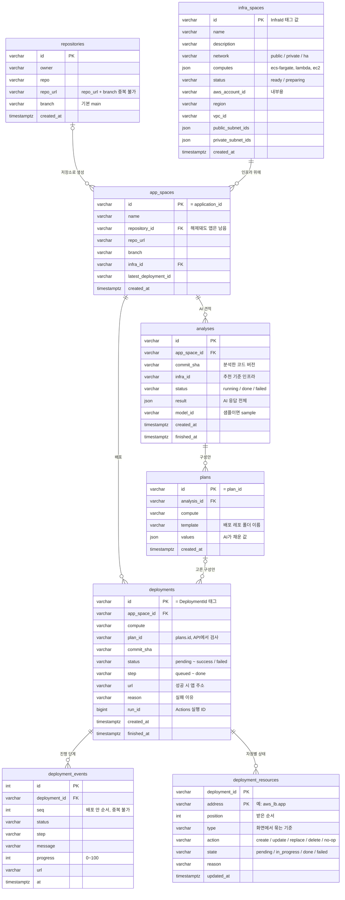

# 플랫폼 DB 설계 (ERD)

플랫폼 DB(RDS PostgreSQL 17, ADR-008)의 테이블 설계다. GitHub와 Notion에서 아래 그림이 바로 보인다.

규칙: 컬럼은 추가만 한다. 삭제·이름 변경 금지 (AGENTS.md 규칙 3). 그래서 만들기 전에 이 문서에서 먼저 맞춘다.

## 테이블별 역할

| 테이블 | 무엇을 저장하나 | 누가 채우나 | 상태 |
|---|---|---|---|
| `infra_spaces` | 미리 지어 둔 인프라 3종. 계정·VPC·서브넷은 배포용 내부 값이라 API 응답에 안 나감 | 마이그레이션 0002 (박준서 님 구축 값) | **구현됨** (퍼블릭만 실제 값) |
| `repositories` | 통합 메뉴에서 등록한 GitHub 저장소. 코드는 저장 안 함 | 사용자 (`POST /api/repositories`) | **구현됨** |
| `app_spaces` | 사용자가 만든 앱 = 저장소 하나 + 인프라 하나 | 사용자 (`POST /api/app-spaces`) | **구현됨** |
| `analyses` | AI 견적. 어느 코드 버전(`commit_sha`), 어느 인프라 기준인지 함께 남김 | 백엔드 + AI (`app/ai`) | **구현됨** (모델 연결 전에는 샘플 결과) |
| `plans` | 템플릿 + 넣을 값. 워크플로가 `plan_id`로 받아 감 | 백엔드 (지금은 템플릿 기본값, 나중에 AI) | **구현됨** |
| `deployments` | 배포 버튼 한 번에 한 줄. 상태, 앱 주소, 실패 이유 | 백엔드 + 배포 워크플로 콜백 | **구현됨** |
| `deployment_events` | 배포 진행 단계. SSE가 다시 연결되면 `seq` 다음부터 보냄 | 배포 워크플로 콜백 (연결 전에는 가짜 진행) | **구현됨** |
| `deployment_resources` | 트리용 자원별 상태. `address` 기준으로 덮어씀 | 배포 워크플로 콜백 | **구현됨** |

## 테이블 상세

키: PK = 이 테이블의 고유 번호, FK = 다른 테이블을 가리킴. 필수: O = 비어 있으면 안 됨.

### infra_spaces (인프라 목록) · 구현됨

| 칸 | 타입 | 키 | 필수 | 설명 |
|---|---|---|---|---|
| `id` | varchar(64) | PK | O | AWS 자원의 `InfraId` 태그와 같은 값 ("AWS 리소스 네이밍 및 태깅 규칙") |
| `name` | varchar(100) | | O | 화면 표시 이름 |
| `description` | varchar(300) | | O | 화면 표시 설명 |
| `network` | varchar(20) | | O | `public` / `private` / `ha`. ADR-003 3종 이름으로 바꿀 때 김동윤 님과 같은 날 바꾼다 |
| `computes` | json | | O | 올릴 수 있는 컴퓨팅. `ecs-fargate`, `lambda`, `ec2` 중에서 (ADR-020) |
| `status` | varchar(20) | | O | `ready`(구축됨) / `preparing`(값 받기 전). 아직 API 응답에는 없음 |
| `aws_account_id` | varchar(12) | | | Workload 계정 ID. 내부용 |
| `region` | varchar(30) | | | 예: `ap-northeast-2` |
| `vpc_id` | varchar(32) | | | 배포 때 워크플로에 넘긴다 (박소정 님 10/2) |
| `public_subnet_ids` | json | | | 〃 |
| `private_subnet_ids` | json | | | 〃 |
| `created_at` | timestamptz | | O | 목록 순서 |

### repositories (등록된 저장소) · 구현됨

| 칸 | 타입 | 키 | 필수 | 설명 |
|---|---|---|---|---|
| `id` | varchar(32) | PK | O | 예: `repo-8a1f3c90b2d4` |
| `owner` | varchar(100) | | O | GitHub 저장소 주인 |
| `repo` | varchar(100) | | O | 저장소 이름 |
| `repo_url` | varchar(300) | | O | `https://github.com/{owner}/{repo}`로 정리해서 저장 |
| `branch` | varchar(255) | | O | 기본 `main` |
| `created_at` | timestamptz | | O | 등록 시각 |

`repo_url` + `branch` 조합은 중복될 수 없다.

### app_spaces (만든 앱) · 구현됨

| 칸 | 타입 | 키 | 필수 | 설명 |
|---|---|---|---|---|
| `id` | varchar(32) | PK | O | 배포 워크플로의 `application_id`, AWS `ApplicationId` 태그와 같은 값. 템플릿 제한으로 24자 이하 (지금 16자) |
| `name` | varchar(100) | | O | 앱 이름 |
| `repository_id` | varchar(32) | FK → repositories | | 등록된 저장소면 연결. 당분간 등록 안 된 저장소도 받아서 비어 있을 수 있다 |
| `repo_url` | varchar(300) | | O | 저장소 등록이 해제돼도 어느 주소였는지 기억 |
| `branch` | varchar(255) | | O | |
| `infra_id` | varchar(64) | FK → infra_spaces | O | 올릴 인프라 |
| `latest_deployment_id` | varchar(32) | | | 최근 배포 (`deployments.id`) |
| `created_at` | timestamptz | | O | |

### analyses (AI 견적) · 구현됨

| 칸 | 타입 | 키 | 필수 | 설명 |
|---|---|---|---|---|
| `id` | varchar(32) | PK | O | 예: `ana-1a2b3c4d5e6f` |
| `app_space_id` | varchar(32) | FK → app_spaces | O | 어느 앱의 견적인지. 여러 번 분석할 수 있고 최신 것을 보여 준다 |
| `infra_id` | varchar(64) | | O | 추천 기준이 된 인프라 (ADR-020). 이 인프라의 `computes` 안에서 후보를 고른다 |
| `commit_sha` | varchar(40) | | | 분석한 코드 버전. 배포 때 같은 커밋을 쓴다. 저장소를 못 읽었거나 샘플이면 비어 있다 |
| `status` | varchar(20) | | O | `running` / `done` / `failed`. 3분 넘게 `running`이면 조회할 때 `failed`로 바꾼다 |
| `result` | json | | | AI 응답 전체(`Analysis`). 형식이 아직 바뀌는 중이라 통째로 저장 |
| `model_id` | varchar(200) | | O | 사용한 Bedrock 모델 (ADR-006). 모델 없이 샘플을 준 경우 `sample` |
| `created_at` | timestamptz | | O | |
| `finished_at` | timestamptz | | | |

### plans (구성안) · 구현됨

| 칸 | 타입 | 키 | 필수 | 설명 |
|---|---|---|---|---|
| `id` | varchar(32) | PK | O | `plan_id`. 워크플로가 이 값으로 템플릿·값·인프라를 받아 간다 (ADR-009, 명세 8-1절) |
| `app_space_id` | varchar(32) | FK → app_spaces | O | |
| `analysis_id` | varchar(32) | FK → analyses | | 만들 때의 최신 완료 분석. 분석 없이 만들었으면 비어 있다 |
| `compute` | varchar(20) | | O | 템플릿이 준비된(`catalog.py`의 `ready`) 컴퓨팅만 |
| `template` | varchar(100) | | O | 배포 레포 `workload-deploy`의 `templates/` 아래 폴더 이름. 예: `ecs-fargate/basic` |
| `values` | json | | O | 템플릿에 넣을 값. 범위를 검사하고 빠진 값은 기본값으로 채운 뒤 저장 (ADR-012) |
| `name`, `summary` | varchar | | O | 화면에 보일 이름·설명 |
| `pros`, `cons` | json | | O | 장단점 목록 |
| `created_at` | timestamptz | | O | 같은 컴퓨팅이면 가장 최근 것을 보여 준다 |

### deployments (배포 기록) · 구현됨

| 칸 | 타입 | 키 | 필수 | 설명 |
|---|---|---|---|---|
| `id` | varchar(32) | PK | O | AWS `DeploymentId` 태그와 같은 값 |
| `app_space_id` | varchar(32) | FK → app_spaces | O | 한 앱에 진행 중인 배포는 하나만 |
| `compute` | varchar(20) | | O | `ecs-fargate` / `lambda` / `ec2` |
| `plan_id` | varchar(32) | | | 고른 구성안 (`plans.id`). 배포 시작 때 이 앱·컴퓨팅의 구성안인지 API가 검사한다. 이미 있는 행 때문에 FK는 걸지 않았다 |
| `commit_sha` | varchar(40) | | | 배포한 코드 버전. 워크플로 실행을 붙일 때 채운다 |
| `status` | varchar(20) | | O | `pending` / `building` / `deploying` / `success` / `failed` |
| `step` | varchar(20) | | O | `queued` / `prepare` / `build` / `deploy` / `verify` / `done` (API 명세 9-3절) |
| `url` | varchar(500) | | | 성공하면 앱 주소 (ALB 주소) |
| `reason` | varchar(1000) | | | 실패 이유. 길면 잘라서 저장 |
| `run_id` | bigint | | | GitHub Actions 실행 ID. 첫 콜백으로 받음 (ADR-009) |
| `created_at` | timestamptz | | O | |
| `finished_at` | timestamptz | | | success 또는 failed가 된 시각 |

### deployment_events (배포 진행 단계) · 구현됨

| 칸 | 타입 | 키 | 필수 | 설명 |
|---|---|---|---|---|
| `id` | int | PK | O | 자동 증가 |
| `deployment_id` | varchar(32) | FK → deployments | O | |
| `seq` | int | | O | 배포 안에서 1, 2, 3 … 순서. SSE 이벤트 id로 쓰고, 다시 연결하면 이 다음부터 보낸다 |
| `status` | varchar(20) | | O | |
| `step` | varchar(20) | | O | |
| `message` | varchar(500) | | O | 화면에 보일 문구 |
| `progress` | int | | O | 0~100. 단계로 정한다 (queued 0, prepare 10, build 30, deploy 60, verify 90, done 100) |
| `url` | varchar(500) | | | 성공 이벤트에만 |
| `at` | timestamptz | | O | |

`deployment_id` + `seq` 조합은 중복될 수 없다. 자원별 콜백도 한 건씩 이벤트로 남아 화면 문구가 바뀐다.

### deployment_resources (자원별 상태, 트리) · 구현됨

| 칸 | 타입 | 키 | 필수 | 설명 |
|---|---|---|---|---|
| `deployment_id` | varchar(32) | PK, FK → deployments | O | |
| `address` | varchar(500) | PK | O | Terraform 자원 주소. 예: `aws_lb.app` |
| `position` | int | | O | 처음 받은 순서. 이 순서로 돌려준다 |
| `type` | varchar(100) | | O | 예: `aws_lb`. 화면은 이걸로 묶는다 |
| `action` | varchar(20) | | O | `create` / `update` / `replace` / `delete` / `no-op` |
| `state` | varchar(20) | | O | `pending` / `in_progress` / `done` / `failed` |
| `reason` | varchar(1000) | | | 실패했을 때만 |
| `updated_at` | timestamptz | | O | |

- 같은 `action`에서 상태가 뒤로 가는 보고(`done` 뒤의 `in_progress`)는 무시한다. `replace`처럼 `action`이 바뀌면 새 작업이라 받는다.
- 조회용 자원(`data.` 주소, `action=read`)은 트리에 넣지 않는다.
